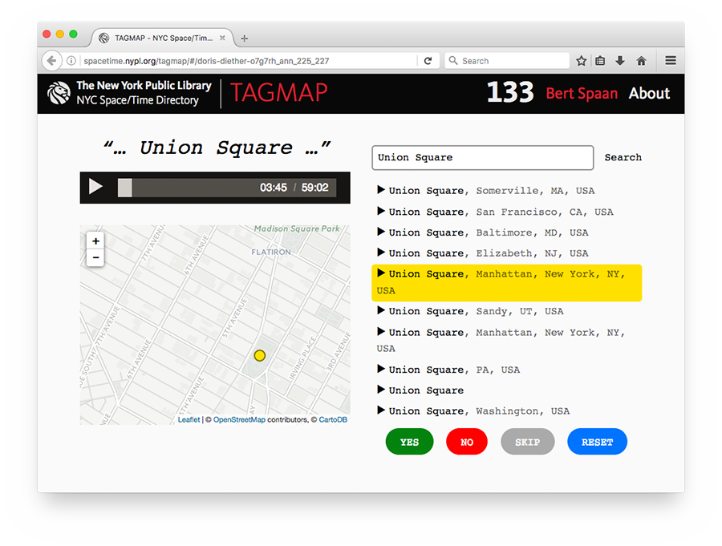
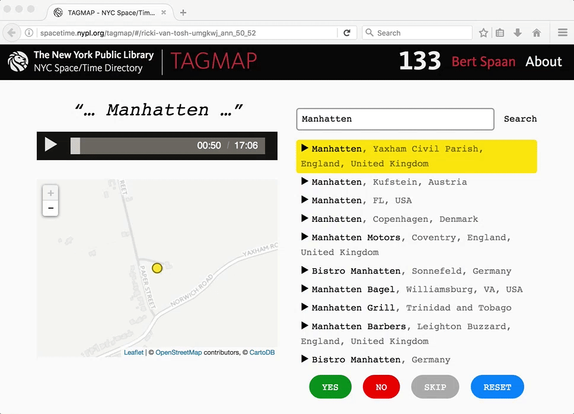

# Space/Time Directory - TAGMAP

TAGMAP is a tool for crowdsourced geotagging of annotations from The New York Public Library's [Community Oral History Project](http://oralhistory.nypl.org/).

See http://spacetime.nypl.org/tagmap (You need an NYPL email address to use TAGMAP).

## Tutorial

TAGMAP shows random annotations from Oral History transcriptions, and tries to find those annotations on a map using a [geographic search engine](https://mapzen.com/products/search/). However, not all annotations are geographic places, and not always does this geographic search engine return the correct results. By telling TAGMAP which annotations are places and which are not, you can help putting Oral History interviews on the map!

Below the list of geographic results, four buttons are shown:

- **YES**: If the search result list contains the correct geographic place, select this result and click **YES**!
- **NO**: The annotation is not a geographic place
- **SKIP**: The annotation is a geographic place, but the search tool either didn't find the correct location, or it is unclear (even after listening to the interview) which exact location is meant.
- **RESET**: Reset the edited search string to the original annotation

## Editing incorrect annotations

When annotations contain spelling errors, are formatted in a strange way, or are in face multiple annotations in one (e.g. [_“1875; Westchester Station”_](http://spacetime.nypl.org/tagmap/#/tom-vasti-t707ay_ann_4531_4533)), you can edit the search string, press enter, and pick the correct result from the list. Sometimes, it can be helpful to add _“New York”_ or _“Manhattan, USA”_ to the search string (e.g. from _“East River”_ to _“East River, Manhattan, NY”_). To reset the search string to the original annotation, click **RESET**.

The animation below shows changing _“Manhatten”_ to _“Manhattan”_:

## Known issues

Under the hood, TAGMAP uses [Mapzen Search](https://mapzen.com/products/search/), a search engine for geographic names. Mapzen Search is free and usually works pretty well, but it does not find the following annotations:

- street names without house numbers (e.g. [_“Sullivan Street”_](http://spacetime.nypl.org/tagmap/#/elaine-mobray-cdgxj0_ann_69_71)) — **SKIP** those items
- intersections (e.g. _“5th Ave and 42nd St”_) — **SKIP** those items

Other issues:

- it is not possible yet to move the map and submit the new position of the map

### Examples

- [_“550 square foot studio”_](http://spacetime.nypl.org/tagmap/#/manya-ellenberg-and-rachel-glickstein-piz21h_ann_66_68): **NO**
- [_“Harlem”_](http://spacetime.nypl.org/tagmap/#/kathy-bristow-g6uztv_ann_17_19): **YES** — `Harlem, Manhattan, New York, NY, USA`
- [_“Punjab”_](http://spacetime.nypl.org/tagmap/#/leslie-taylor-3hkc34_ann_508_510): **NO** — Punjab is a [state in India](https://en.wikipedia.org/wiki/Punjab,_India), but listening to the audio will reveil that Leslie Taylor is talking about a restaurant on Bleecker Street. SKIP this item for now.
- [_“187 Street”_](http://spacetime.nypl.org/tagmap/#/ed-lehner-z1s7bn_ann_2893_2895): **SKIP** — TAGMAP cannot currently find streets without house numbers
- [_“420 Broadway”_](http://spacetime.nypl.org/tagmap/#/zigi-ben-haim-6vql95_ann_305_307): **YES** — `420 Broadway, Manhattan, New York, NY, USA`

